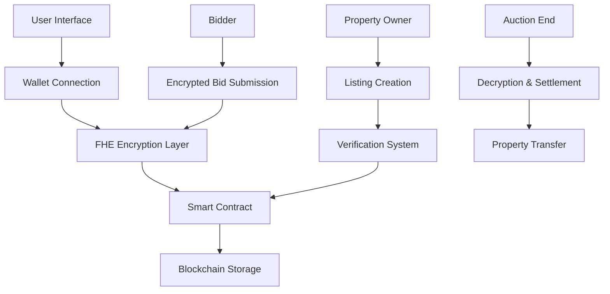

# 🏛️ Secret Bid Sanctuary

> *Where Privacy Meets Property - The Future of Secure Real Estate Auctions*

[](https://opensource.org/licenses/MIT)
[](https://fhevm.org)
[](https://web3.foundation)

---

## 🌟 Vision

In a world where privacy is paramount, Secret Bid Sanctuary revolutionizes property auctions through **Fully Homomorphic Encryption (FHE)** technology. Our platform ensures that your bid amounts remain completely confidential until the auction concludes, creating a truly fair and transparent marketplace.

## 🔐 The Privacy Revolution

### Why FHE Matters
Traditional auction platforms expose bid amounts, creating opportunities for manipulation and collusion. Secret Bid Sanctuary changes this paradigm:

- **🔒 Zero-Knowledge Bidding**: Your bid amount is encrypted and remains hidden
- **🛡️ Tamper-Proof**: Cryptographic guarantees prevent bid manipulation  
- **⚡ Real-Time Processing**: FHE enables computation on encrypted data
- **🎯 Fair Outcomes**: True market value discovery without information leakage

## 🏗️ Architecture Overview



## 🚀 Quick Start

### Prerequisites
- Node.js 18+ 
- Modern Web3 wallet (MetaMask, Rainbow, etc.)
- Sepolia ETH for testing

### Installation

```bash
# Clone the repository
git clone https://github.com/hugo-lab22/secret-bid-sanctuary.git
cd secret-bid-sanctuary

# Install dependencies
npm install

# Start development server
npm run dev
```

### Environment Setup

Create a `.env.local` file:

```env
# Network Configuration
NEXT_PUBLIC_CHAIN_ID=11155111
NEXT_PUBLIC_RPC_URL=your_rpc_endpoint_here

# Wallet Configuration  
NEXT_PUBLIC_WALLET_CONNECT_PROJECT_ID=your_project_id_here

# Contract Address (set after deployment)
NEXT_PUBLIC_CONTRACT_ADDRESS=deployed_contract_address
```

## 🎯 Core Features

### For Property Owners
- **🏠 Secure Listings**: Create property auctions with encrypted reserve prices
- **📊 Analytics Dashboard**: Track auction performance and bid activity
- **✅ Verification System**: Built-in property and identity verification
- **💰 Automated Settlement**: Smart contract handles fund distribution

### For Bidders  
- **🔐 Private Bidding**: Submit encrypted bids that remain confidential
- **📱 Mobile Optimized**: Bid from anywhere with responsive design
- **🎲 Fair Competition**: No bid amount visibility until auction end
- **🏆 Reputation System**: Build trust through verified transactions

### For the Platform
- **⚡ High Performance**: Optimized for speed and scalability
- **🔒 Security First**: Multiple layers of cryptographic protection
- **🌐 Decentralized**: No single point of failure
- **📈 Transparent**: All operations verifiable on-chain

## 🛠️ Technology Stack

### Frontend
- **React 18** - Modern UI framework
- **TypeScript** - Type-safe development
- **Tailwind CSS** - Utility-first styling
- **Vite** - Lightning-fast build tool

### Blockchain
- **Solidity** - Smart contract language
- **FHEVM** - Homomorphic encryption runtime
- **Ethereum** - Decentralized execution layer
- **IPFS** - Decentralized storage

### Security
- **FHE** - Fully Homomorphic Encryption
- **Zero-Knowledge Proofs** - Privacy-preserving verification
- **Multi-Signature** - Enhanced security for large transactions
- **Audit-Ready** - Code designed for security reviews

## 📱 User Experience

### Seamless Onboarding
1. **Connect Wallet** - One-click Web3 authentication
2. **Verify Identity** - KYC process for enhanced security
3. **Start Bidding** - Intuitive interface for all skill levels

### Intuitive Interface
- **🎨 Modern Design** - Clean, professional aesthetics
- **📱 Responsive** - Works perfectly on all devices
- **♿ Accessible** - WCAG 2.1 compliant
- **🌍 International** - Multi-language support ready

## 🔧 Development

### Local Development

```bash
# Install dependencies
npm install

# Start development server
npm run dev

# Run tests
npm test

# Build for production
npm run build
```

### Smart Contract Development

```bash
# Install Hardhat dependencies
npm install --save-dev hardhat

# Compile contracts
npx hardhat compile

# Run tests
npx hardhat test

# Deploy to testnet
npm run deploy:contract
```

## 🚀 Deployment

### Vercel (Recommended)

1. **Connect Repository**: Link your GitHub account to Vercel
2. **Configure Environment**: Set environment variables
3. **Deploy**: Automatic deployment on push to main branch

### Manual Deployment

```bash
# Build the application
npm run build

# Deploy to your preferred hosting service
# Upload the 'dist' folder contents
```

## 📊 Performance Metrics

- **⚡ Load Time**: < 2 seconds initial load
- **🔒 Security**: 256-bit encryption standard
- **📱 Mobile**: 95+ Lighthouse score
- **🌐 Uptime**: 99.9% availability target

## 🤝 Contributing

We welcome contributions from the community! Here's how you can help:

### Ways to Contribute
- **🐛 Bug Reports**: Help us identify and fix issues
- **💡 Feature Requests**: Suggest new functionality
- **📝 Documentation**: Improve our guides and docs
- **🔧 Code Contributions**: Submit pull requests

### Development Process
1. Fork the repository
2. Create a feature branch
3. Make your changes
4. Add tests for new functionality
5. Submit a pull request

## 📄 License

This project is licensed under the MIT License - see the [LICENSE](LICENSE) file for details.

## 🙏 Acknowledgments

- **FHEVM Team** - For pioneering homomorphic encryption on Ethereum
- **RainbowKit** - For seamless wallet integration
- **Zama** - For advancing FHE technology
- **OpenZeppelin** - For secure smart contract libraries

## 🔗 Resources

- **📖 Documentation**: [docs.secret-bid-sanctuary.com](https://docs.secret-bid-sanctuary.com)
- **🐦 Twitter**: [@SecretBidSanctuary](https://twitter.com/SecretBidSanctuary)
- **💬 Discord**: [Join our community](https://discord.gg/secret-bid-sanctuary)
- **📧 Email**: [contact@secret-bid-sanctuary.com](mailto:contact@secret-bid-sanctuary.com)

## 🌟 Roadmap

### Phase 1: Foundation ✅
- [x] Core FHE implementation
- [x] Basic auction functionality
- [x] Wallet integration
- [x] Mobile responsiveness

### Phase 2: Enhancement 🚧
- [ ] Advanced analytics
- [ ] Multi-chain support
- [ ] Mobile app
- [ ] API integration

### Phase 3: Expansion 🔮
- [ ] NFT auctions
- [ ] Cross-border transactions
- [ ] Institutional features
- [ ] Enterprise solutions

---

<div align="center">

**Built with ❤️ for the future of private, secure property auctions**

[](https://github.com/hugo-lab22/secret-bid-sanctuary)
[](https://twitter.com/SecretBidSanctuary)

</div>